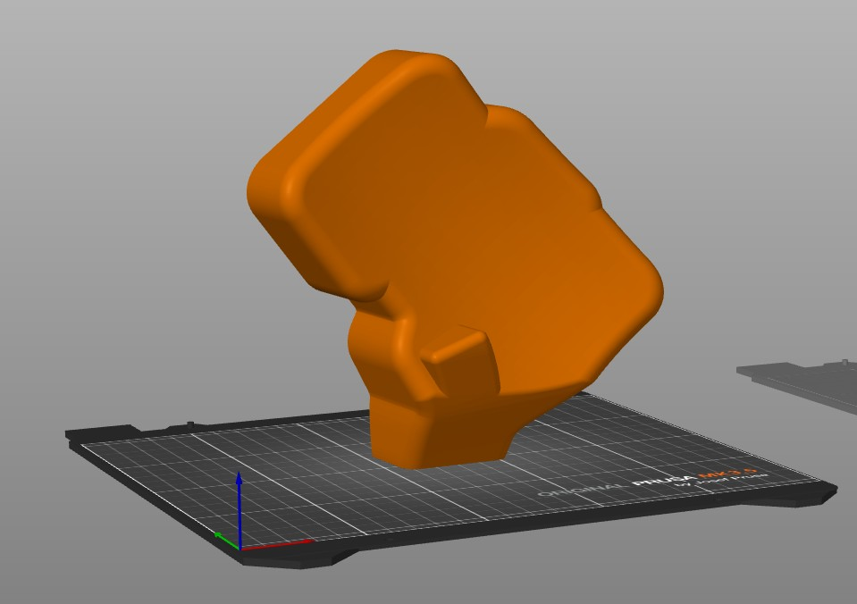

# Charybdis Mini travel case

# Introduction

I have a Charybdis mini wireless keyboard and I was not happy with the lack of options for protecting it during my commutes. 
Working in an IT company means that some days it is office and some others it is working from home. 
Since the Charybdis mini is my favorite keyboard I really needed a way to carry it safely.

I had in mind a very curvy and organic travel case that fitted the keyboard perfectly. 
**More than 50 hours of design and lots of filament in prototypes** were invested to get the final result. 
Now I can throw my keyboard with the travel case inside my backpack when commuting and it is perfectly protected. 
Each side is formed by two pieces that snap together perfectly with **6mm diameter and 3mm height magnets**. 
All the design was done in **Shapr3D on my iPad Pro** , which BTW is an amazing tool.

Case was designed with my keycaps in mind. I have tried both **XDA and HSA keycaps and it fits great**. 
You may need to adapt the base of the keyboard for fitting your own keycaps, especially if you use SA or MT3 or some tall keycaps.

## Contents of this repository

This repository contains 2 versions of the case:

- **Flat**: Flat version of the bottom part, no flange. Base should be easier to adapt and modify, even for Flange version if needed.
- **Flange**: Version with a flange on the bottom part, which is easier to open by using your thumb in the flange. It is also more aesthetically pleasing if you print both parts in different colors. 

For each version, there are 4 files: top left, top right, bottom left, bottom right. You will need to print the 4 files for the version you choose.

## How to print

The following parameters were used when printing and confirmed to give good results:

- Material: PLA
- Nozzle: 0.4mm
- Layer height: 0.08mm
- Slicer: Orca Slicer

Something that worked well for me is to disable the options **Speed - Overhang speed - Slow down for overhangs** and **Slow down for curled perimeters**.

### Top parts

Print vertically, using the small cut surface for the flange in the thumb cluster and use tree organic supports.
There will be some minor marks in the outside of the case because of the contact with the bed and some external supports, but for the rest of the print it will be perfect.

### Bottom parts

Place those horizontally on the printing bed.

## License and attribution

Follow us on instagram: @CASLArt3D

@CASLArt3D, Casla, Segovia

Creative Commons Attribution-NonCommercial-ShareAlike 4.
International License.

Does this mean I can print it and use it for free? 
Yes! But I would like you to consider a couple of things:

1. Follow my instagram @CASLArt3D for more designs like this
1. If you like this and find this useful I would really appreciate if you could buy me a coffee, this will help me a lot with future designs.
1. Share your print on your social media and tag me, thanks!

## Additional information

Version A, December the 8th 2024

[Click here to view the case in 3D even in augmented reality](https://collaborate.shapr3d.com/v/Hb1HOA_byMEFyQqiXjbRR)

I have invested a lot of work on this case and I am really proud of the results.
